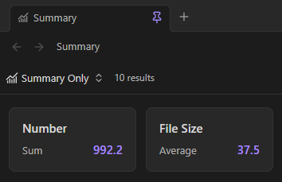
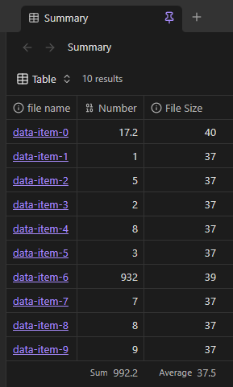

# SummaryOnly Plugin for Obsidian

[](https://github.com/TylerCarrol/obsidian-summary-only/releases/latest) [](https://github.com/TylerCarrol/obsidian-summary-only/blob/main/LICENSE) [](https://github.com/TylerCarrol/obsidian-summary-only/actions/workflows/lint.yml) [](https://github.com/TylerCarrol/obsidian-summary-only/actions/workflows/test.yml)

SummaryOnly adds a **Summary only** view to Obsidian Bases. The view hides the
rows and instead, just displays the summaries as cards.

## Examples

##### Summary


##### Table
> Source data



## Install for development

1. Install dependencies:
   ```bash
   npm install
   ```
2. Build the plugin:
   ```bash
   npm run build
   ```
3. Copy `main.js`, `manifest.json`, and `styles.css` to:
   ```text
   <Vault>/.obsidian/plugins/summary-only/
   ```
4. In Obsidian, enable **Settings → Community plugins → summary-only**.

For watch mode during development:

```bash
npm run dev
```

## Fastest way to try it

This repository includes a ready-made demo vault in `/summary-only-demo-vault`.

- Windows/PowerShell:
  ```powershell
  .\scripts\build-to-demo-vault.ps1
  ```
- Any platform:
  1. Run `npm run build`
  2. Copy `main.js`, `manifest.json`, and `styles.css` to `summary-only-demo-vault/.obsidian/plugins/summary-only/`
  3. Open `summary-only-demo-vault` in Obsidian

See `summary-only-demo-vault/README.md` for a guided walkthrough.

## Use the Summary only view

1. Open a `.base` file in Obsidian.
2. Open the view menu in the top-left corner.
3. Add a view and select **Summary only**.
4. Configure summaries for the properties that you want to display.

Each card shows the property name, the summary name, and the calculated value.
Use the view settings menu to adjust **Card width** and **Card height** with
sliders. Enable **Show summary editor** to display every property in the view
and choose a summary for each card.
